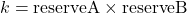

# LiquidityMath

## Overview

The `LiquidityMath` contract provides a function to calculate the optimal amount of a token to swap when adding liquidity to a pool, specifically for a Uniswap V2-style pool without concentrated liquidity. This ensures that the user's holdings are proportional to the pool's reserves.

## Derivation

1. **Initial constant product**:
   

2. **After swap, the new reserveB**:
   

3. **Amount of asset B received**:
   
   
   
   

4. **Equality constraint on user's asset ratio and reserve's asset ratio**:
   

5. **Substitute known variables**:
   

6. **Solve for swapA**:
   

7. **With fee represented in hundredths of a bip**:
   

## Final Equation

Where:

- \(\text{fee}\) is the swap fee in hundredths of a bip.
- \(\text{reserveA}\) is the reserve of token A in the pool.
- \(\text{amountA}\) is the amount of token A to add.

This equation ensures that the proportion of assets the user holds is equal to the proportion of assets in the reserves after the swap.
